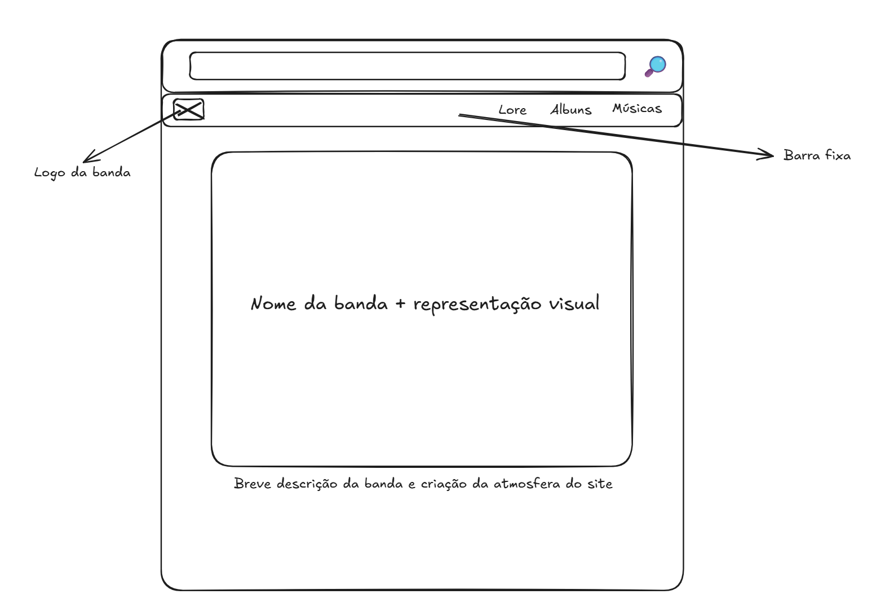
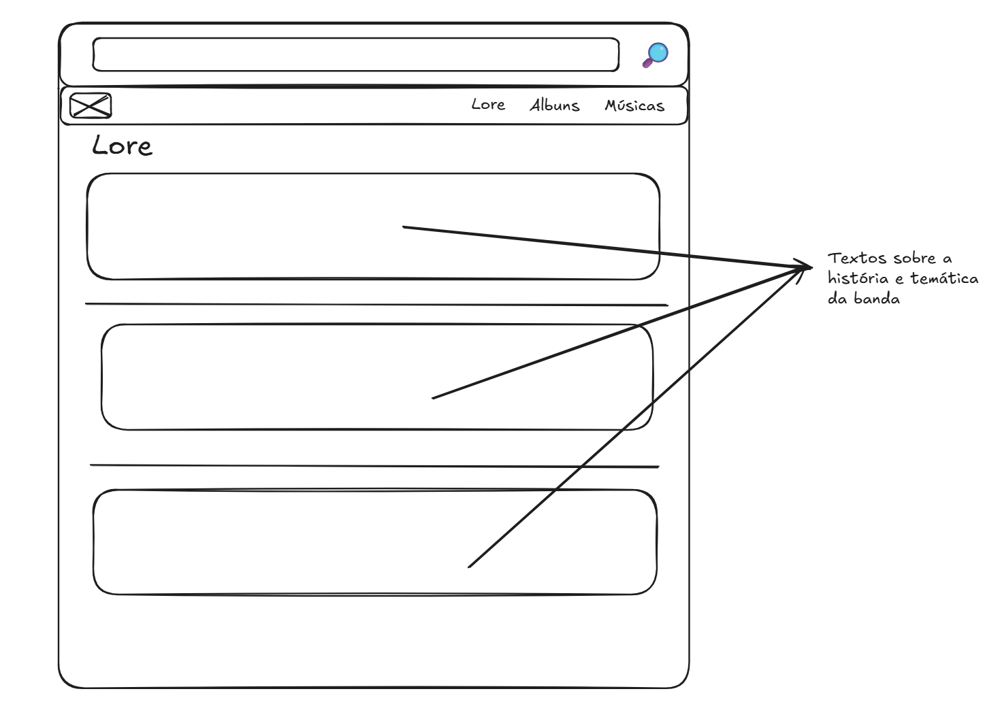
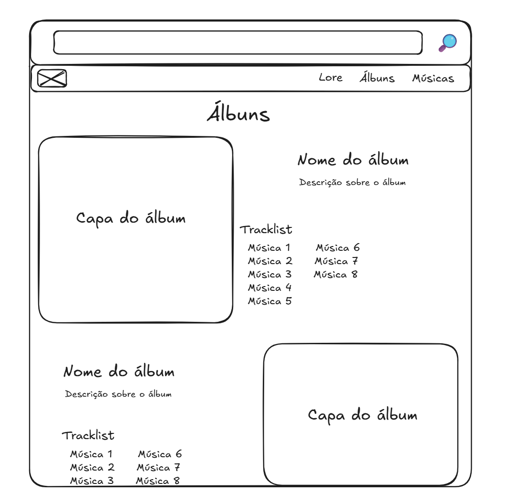
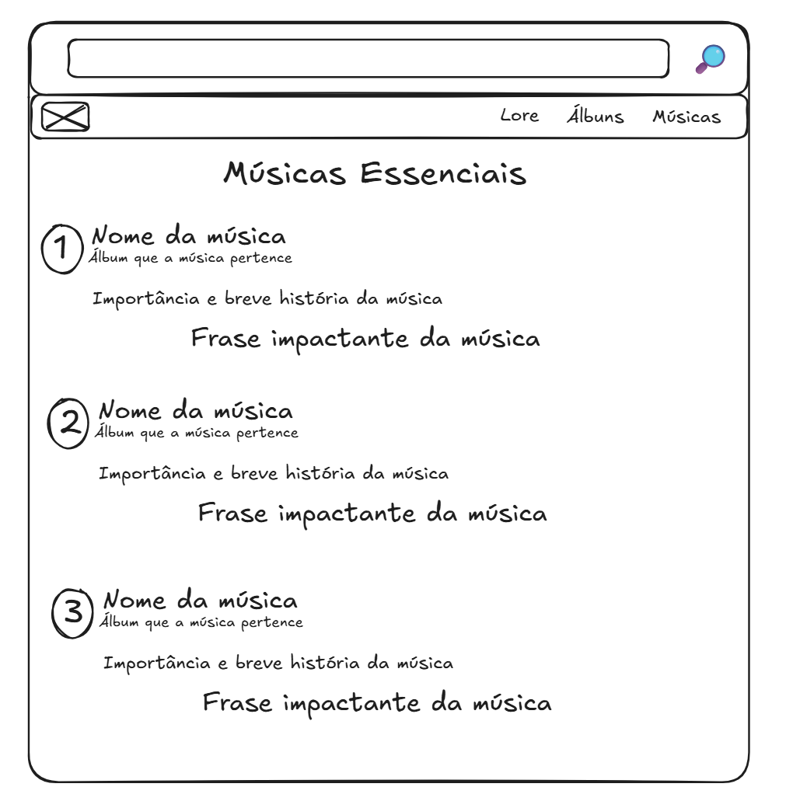
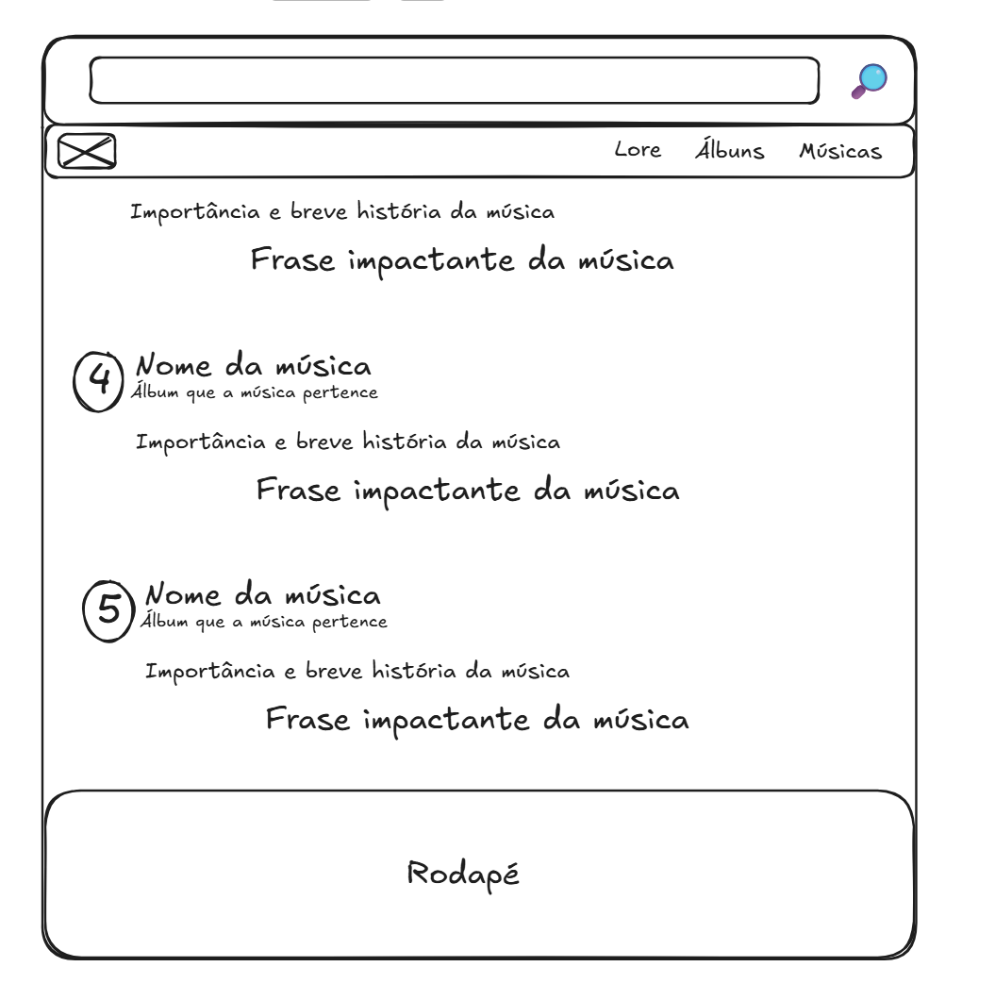
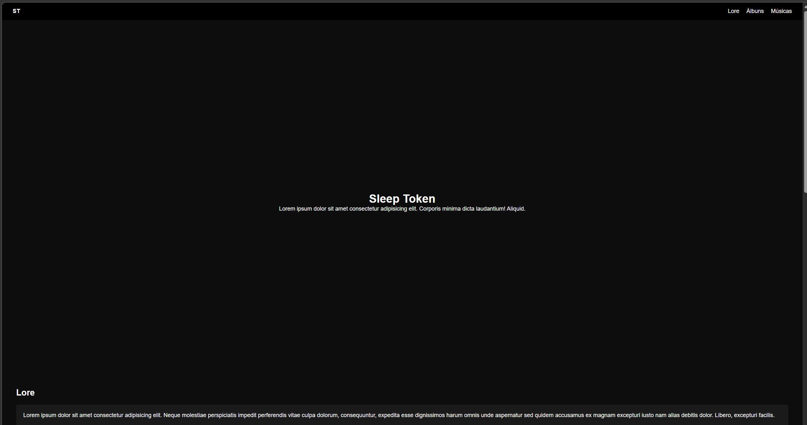
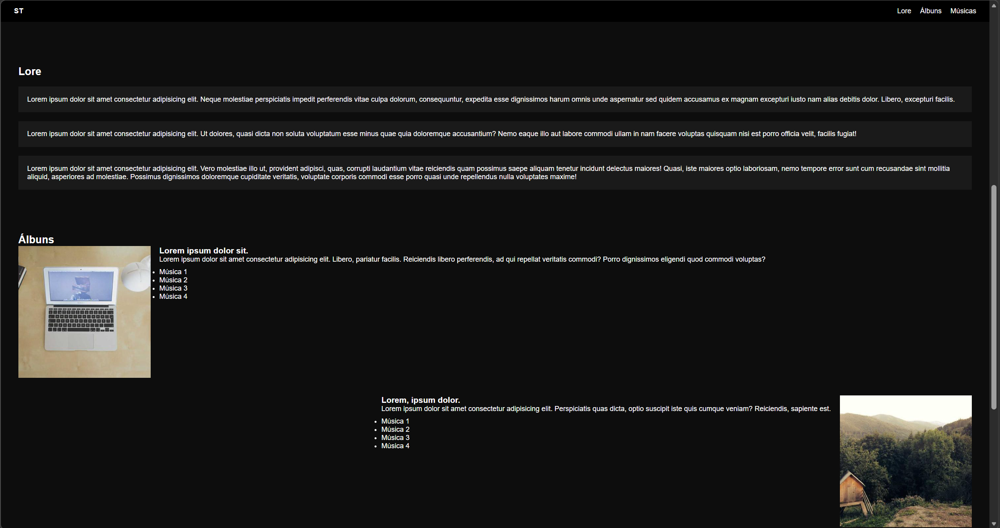
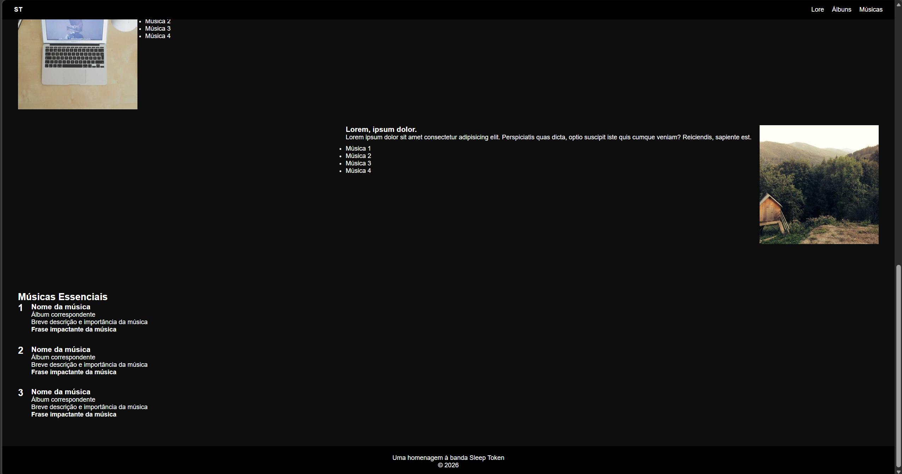

# Trabalho Prático - Semana 4 
> DWFE 2026/1

Dessa vez, vamos escolher uma proposta de projeto para trabalhar.

Nessa atividade, você deverá montar a página inicial do projeto escolhido, a organização do HTML aplicando semântica correta e uso aprimorado do CSS. Leia o enunciado completo no Canvas para mais detalhes.

**IMPORTANTE:** Você deve trabalhar e alterar apenas arquivos dentro da pasta **`public`**. Deixe todos os demais arquivos e pastas desse repositório inalterados. **PRESTE MUITA ATENÇÃO NISSO.**

## Informações Gerais

- Nome: Raphael Lima 
- Matricula: 917322
- Proposta de projeto escolhida: 1. Pessoas e Produções
- Breve descrição sobre seu projeto: Um site que apresenta os álbuns da banda Sleep Token como coleções narrativas, explorando a lore, significados e atmosferas de cada música. A aplicação organiza os álbuns como entidades principais e suas músicas como itens, permitindo ao usuário explorar a história por trás das obras.

## Print do(s) wireframe(s) criado
> Sugestão, use o Excalidraw para isso. Utilize esse [template básico](https://excalidraw.com/#json=LU-8hwcQEwzk11FwO8Opo,qPU9K6cNUEzlXzwOuKMIlQ) para você começar.

## Print da home-page criada

